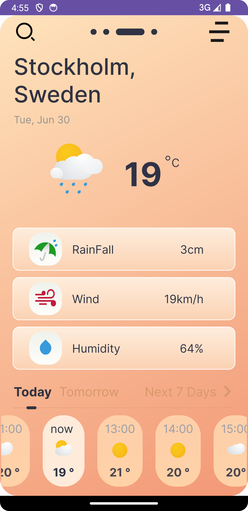

# Android-lesson-4
Android lesson 4 Weather UI
## Weather Screen UI
### Screen 1

### Screen 2

### Mobile view:

## Teacher <a href="http://github.com/zayniddinmamarasulov">ZayniddinMamarasulov</a>
